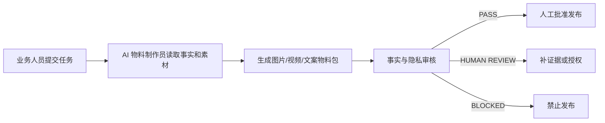

# 从这里调用 SilicateChem AI 物料制作员

## 当前状态

这是一个“内部 AI 员工规范包”，目前位于：

`docs/ai-employees/silicatechem-media-producer/`

它还没有做成网页按钮，也没有部署到 Vercel。现在可以通过 ChatGPT/Codex 对话调用，网站不会自动读取它，也不会自动发布物料。

## 当前最快调用方式

在对话中直接发送：

```text
调用 SilicateChem AI 物料制作员。
目标页面：
目标 ICP：
产品/Grade：
目标关键词：
真实素材路径或附件：
可使用的事实资料：
期望物料：
期望 CTA：
请按 PASS / HUMAN REVIEW / BLOCKED 输出，并交付标题、说明、分镜、字幕、Alt 文本、证据来源和风险清单。
```

如果需要真实图片或视频处理，请同时上传原始图片/视频，或者提供项目中的绝对路径。

## 员工工作链路



## 员工文件

- `SYSTEM_PROMPT.md`：员工的核心行为规则
- `TASK_TEMPLATE.md`：业务人员接单模板
- `WORKFLOW.md`：制作和审核流程
- `QUALITY_GATE.md`：发布前质量门禁
- `ASSET_REGISTER.md`：图片、视频和事实来源登记规则

## 当前不能做的事

- 不能通过网站后台点击调用
- 不能自动上传到网站
- 不能自动发布生产页面
- 不能把 AI 生成内容当作真实工厂证据
- 不能替代业务人员确认客户授权和事实

## 可视化工作台的下一阶段

如果需要和员工像操作后台一样协作，应建设 `/admin/media-ai`：

1. 左侧：任务队列和 ICP 筛选
2. 中间：聊天式任务面板和生成过程
3. 右侧：图片/视频预览、字幕、SEO 文案和证据来源
4. 底部：`PASS`、`HUMAN REVIEW`、`BLOCKED` 审核按钮
5. 后台保存物料版本、原始素材、授权状态和发布记录

这个工作台需要单独的页面、对象存储、媒体处理和 AI 调用接口；目前尚未实施。
