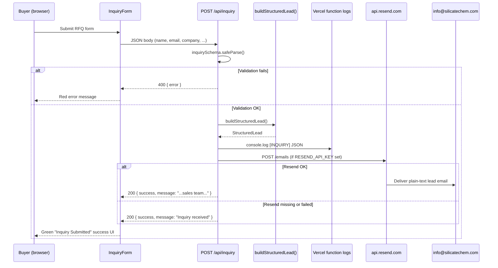

# RFQ Email Delivery Setup — silicatechem.com

**Audit:** REVIEW-011B  
**Goal:** Ensure every inquiry form submission can reach **info@silicatechem.com**  
**Date:** 2026-06-19  
**P0 failure audit:** See `seo/RFQ_EMAIL_FAILURE_AUDIT.md` — production confirmed not sending (missing `RESEND_API_KEY`); silent-success bug fixed in code pending deploy.

Related references:

- `src/app/api/inquiry/route.ts` — inquiry API + Resend send
- `src/lib/leads.ts` — structured lead builder
- `src/lib/validation.ts` — Zod inquiry schema
- `seo/leads/lead-tracking.md` — form fields, attribution, analytics
- `seo/deployment-guide.md` — full Vercel env var table
- `.env.example` — local env template

> **Note:** No `REVIEW-EMAIL.md` exists in this repo. This file is the canonical RFQ email setup and audit document.

---

## Executive summary

| | |
|---|---|
| **Overall status** | **NOT READY** for guaranteed inbox delivery |
| **Blockers** | **4** launch blockers (see checklist below) |
| **Code path** | Implemented — `POST /api/inquiry` → Resend → `info@silicatechem.com` |
| **Production gap** | `RESEND_API_KEY` not confirmed on Vercel; `silicatechem.com` has **no Resend DNS records** (live check 2026-06-19) |
| **DNS host** | Nameservers: `ns1.vercel-dns.com`, `ns2.vercel-dns.com` — add Resend records in **Vercel → Domains → silicatechem.com → DNS** |

**What works today without Resend:** Form validation, structured lead JSON logged to Vercel function logs (`[INQUIRY]`), HTTP 200 success response, and GA4 `generate_lead` on successful submit.

**What does not work without Resend:** No email is sent. The sales team has no automatic notification unless someone monitors Vercel logs. Users still see the green success UI.

---

## Readiness checklist (REVIEW-011B)

| # | Area | Status | Finding |
|---|------|--------|---------|
| 1 | Inquiry API route | **PASS** | `POST /api/inquiry` — Zod validation, structured lead, Node runtime |
| 2 | Lead builder | **PASS** | `buildStructuredLead()` — id, classification, funnel layer, meta |
| 3 | Resend integration (code) | **PASS** | Direct `fetch` to `https://api.resend.com/emails`; plain-text body; `reply_to` set |
| 4 | From/to defaults | **PASS** | `INQUIRY_*` env vars fall back to `SITE.email` (`info@silicatechem.com`) |
| 5 | Email templates | **PASS** | Inline plain text (no HTML/React Email) |
| 6 | Form UX (validation errors) | **PASS** | 400/500 → red inline error; network errors caught |
| 7 | Form UX (email failure) | **FIXED (deploy pending)** | Code returns HTTP 503 + form red error when Resend skipped/fails; production still on old build |
| 8 | `RESEND_API_KEY` on Vercel Production | **BLOCKER** | Not verifiable from repo; must be set manually before launch |
| 9 | Resend domain DNS (`silicatechem.com`) | **BLOCKER** | Live `dig` (2026-06-19): no DKIM, SPF, or MX on `send` — domain not verified |
| 10 | `info@` mailbox | **BLOCKER** | Hosting/monitoring unconfirmed — Resend delivers *to* this address but does not host it |
| 11 | Rate limiting / anti-spam | **WARNING** | No middleware, CAPTCHA, honeypot, or IP throttling on `/api/inquiry` |
| 12 | `.env.example` SMTP vars | **WARNING** | Commented SMTP block is unused — only Resend path is implemented |
| 13 | Stale docs (`[LEAD]`, `leadId`) | **WARNING** | `seo/leads/lead-schema.md`, `seo/launch-checklist.md` still reference old log prefix/response |
| 14 | Analytics on silent failure | **WARNING** | `generate_lead` fires on HTTP 200 even when email was not sent |

---

## Audit results by area

### 1. Current inquiry API

| Status | **PASS** |
|--------|----------|

| Item | Finding |
|------|---------|
| Route | `POST /api/inquiry` (`src/app/api/inquiry/route.ts`) |
| Runtime | Node.js (`export const runtime = "nodejs"`) — compatible with Vercel serverless |
| Validation | `inquirySchema` in `src/lib/validation.ts` — name, company, email, country, message (min 10 chars); optional product, quantity, requestType, source |
| Lead structure | `buildStructuredLead()` in `src/lib/leads.ts` — id, timestamps, contact, interest, classification (inquiry type + funnel layer), meta |
| Logging | Full lead JSON logged as `[INQUIRY]` on every successful validation |
| Response | HTTP 200 + `{ success, emailDelivered: true }` when Resend sends; HTTP 503 + `{ error, emailDelivered: false }` when email fails; HTTP 400/500 on validation/server errors |

**Minor doc drift:** `seo/leads/lead-schema.md` references `[LEAD]` log prefix and a `leadId` response field. The live API uses `[INQUIRY]` and does not return `leadId` in the JSON response.

---

### 2. Resend integration

| Status | **WARNING** — code ready; production credentials and domain verification unconfirmed |
|--------|-------------------------------------------------------------------------------------|

`sendInquiryEmail()` in `src/app/api/inquiry/route.ts`:

| Step | Implementation |
|------|----------------|
| Auth | `Authorization: Bearer ${RESEND_API_KEY}` |
| Endpoint | `POST https://api.resend.com/emails` |
| From | `INQUIRY_FROM_EMAIL` or `SITE.email` (`info@silicatechem.com`) |
| To | `INQUIRY_TO_EMAIL` or `SITE.email` (`info@silicatechem.com`) |
| Reply-To | Submitter's email (`lead.contact.email`) |
| Subject | `[SilicateChem] {INQUIRY_TYPE} — {Company}` |
| Body | Plain `text` field only |
| Error handling | Non-OK response → `console.error("[INQUIRY] Resend error:", ...)` → API returns HTTP 503 to client |

No Resend SDK — direct `fetch`. No retry logic. No queue or dead-letter storage.

---

### 3. Email templates

| Status | **PASS** (plain text by design) |
|--------|-----------------------------------|

There is **no HTML template**, React Email component, or external template file. The email body is built inline as a multi-line plain-text string containing:

- Lead ID, submitted timestamp
- Contact: name, email, company, country
- Interest: product, quantity
- Classification: inquiry type, source page, funnel layer
- Full message text

This is appropriate for transactional lead notifications. No branding or HTML formatting.

---

### 4. Required environment variables

| Status | **WARNING** — documented; production values must be set on Vercel |
|--------|---------------------------------------------------------------------|

| Variable | Required for email | Default / example | Notes |
|----------|-------------------|-------------------|-------|
| `RESEND_API_KEY` | **Yes** | `re_xxxxxxxxxxxx` | Missing → HTTP 503 after code deploy; HTTP 200 false success on current production |
| `INQUIRY_TO_EMAIL` | Recommended | `info@silicatechem.com` | Falls back to `SITE.email` |
| `INQUIRY_FROM_EMAIL` | Recommended | `info@silicatechem.com` | Falls back to `SITE.email`; must be on a **verified Resend domain** |
| `SITE.email` (code constant) | Fallback | `info@silicatechem.com` | `src/lib/constants.ts` — not an env var |

**Not implemented:** `.env.example` lists commented SMTP vars (`SMTP_HOST`, etc.) but the inquiry route does **not** use Nodemailer or SMTP. Resend is the only email path.

---

### 5. Fallback behavior (Resend not configured)

| Status | **BLOCKER** for guaranteed delivery — **code fix applied locally, deploy pending** |
|--------|-------------------------------------------------------------------------------------|

**Production today (pre-deploy):** Returns HTTP 200 even when email fails — see `seo/RFQ_EMAIL_FAILURE_AUDIT.md`.

**After code deploy** — when `RESEND_API_KEY` is unset or Resend rejects the send:

1. Lead is still logged to server console as `[INQUIRY]` JSON
2. API returns **HTTP 503** with `{ error: "...contact us at info@...", emailDelivered: false }`
3. **No email is sent**
4. Form shows **red error** with direct-contact fallback (email / WhatsApp)
5. **No CRM, webhook, or alternate notification** — ops must configure Resend

When Resend is configured and send succeeds:

1. API returns HTTP 200 with `{ success: true, emailDelivered: true, message: "...sales team..." }`
2. Form shows green success UI
3. Plain-text email delivered to `INQUIRY_TO_EMAIL`

---

## Resend account setup (step by step)

### Step 1 — Create Resend account

1. Sign up at [resend.com](https://resend.com).
2. Confirm your account email.

### Step 2 — Create API key

1. Resend dashboard → **API Keys** → **Create API Key**.
2. Name: e.g. `silicatechem-production`.
3. Permission: **Sending access** (full access is fine for a single-app setup).
4. Copy the key — it starts with `re_`. Store securely; it is shown once.

### Step 3 — Add and verify domain

1. Dashboard → **Domains** → **Add Domain**.
2. Enter: `silicatechem.com`.
3. Choose region closest to buyers (e.g. `us-east-1` for global B2B; match your DNS MX region).
4. Resend displays **exact DNS records** — copy them from the dashboard (values are unique per account; do not use generic examples from third-party blogs).

### Step 4 — Add DNS records at your DNS host

DNS for `silicatechem.com` may be at your registrar, Cloudflare, or another provider. **Add records where nameservers point** (check with `dig NS silicatechem.com` or [dns.email](https://dns.email)).

Per [Resend domain verification docs](https://resend.com/docs/knowledge-base/what-if-my-domain-is-not-verifying), you need **three record types**:

#### DKIM (TXT on root domain)

| Field | Value |
|-------|-------|
| **Type** | `TXT` |
| **Name / Host** | `resend._domainkey` (registrar may show `resend._domainkey.silicatechem.com`) |
| **Value** | Long string from Resend dashboard (starts with `p=...`) — copy exactly |

Verify:

```bash
nslookup -type=TXT resend._domainkey.silicatechem.com
```

#### SPF (TXT on `send` subdomain)

| Field | Value |
|-------|-------|
| **Type** | `TXT` |
| **Name / Host** | `send` |
| **Value** | From Resend (typically `v=spf1 include:amazonses.com ~all`) |

Verify:

```bash
nslookup -type=TXT send.silicatechem.com
```

#### SPF / bounce handling (MX on `send` subdomain)

| Field | Value |
|-------|-------|
| **Type** | `MX` |
| **Name / Host** | `send` |
| **Priority** | `10` (use `20` or `30` if `10` is already taken — do not duplicate priority) |
| **Value** | From Resend (e.g. `feedback-smtp.us-east-1.amazonses.com` — **region must match** your Resend domain region) |

If your DNS provider auto-appends the domain to MX targets, add a **trailing dot**: `feedback-smtp.us-east-1.amazonses.com.`

Verify:

```bash
nslookup -type=MX send.silicatechem.com
```

#### Optional but recommended — DMARC

Only if you do not already have a DMARC record:

| Field | Value |
|-------|-------|
| **Type** | `TXT` |
| **Name / Host** | `_dmarc` |
| **Value** | `v=DMARC1; p=none;` (or stricter policy once sending is stable) |

**Important:** SPF and MX records go on the **`send`** subdomain, not the apex `@`. DKIM goes on **`resend._domainkey`** at the root domain. Record values must match Resend’s dashboard exactly.

Because `silicatechem.com` uses **Vercel DNS**, add these records in the Vercel project dashboard (not at a third-party registrar unless nameservers are changed).

### Live DNS audit (2026-06-19)

Checked from audit environment via `dig`:

| Record | Expected (Resend) | Live result |
|--------|-------------------|-------------|
| NS | — | `ns1.vercel-dns.com`, `ns2.vercel-dns.com` |
| TXT `resend._domainkey.silicatechem.com` | DKIM public key | **Not found** |
| TXT `send.silicatechem.com` | SPF (`v=spf1 include:amazonses.com ~all`) | **Not found** |
| MX `send.silicatechem.com` | AWS SES feedback endpoint | **Not found** |

**Conclusion:** Sender domain is **not verified** for Resend. Sends from `info@silicatechem.com` will fail until DNS records are added and verified in Resend.

Re-check after adding records:

```bash
dig +short TXT resend._domainkey.silicatechem.com
dig +short TXT send.silicatechem.com
dig +short MX send.silicatechem.com
```

### Step 5 — Verify in Resend

1. After DNS propagation (often 15 minutes; up to 72 hours), click **Verify DNS Records** in Resend.
2. All indicators should turn green.
3. You may then send from any address `@silicatechem.com`, e.g. `info@silicatechem.com` or `SilicateChem <info@silicatechem.com>`.

### Step 6 — Confirm inbox for `info@silicatechem.com`

Resend **sends** email; it does not host the `info@` mailbox unless you enable Resend **Receiving** (separate product). Ensure `info@silicatechem.com` is a real mailbox (Google Workspace, Zoho, cPanel, etc.) or forwarded to your sales team.

---

## Vercel environment variables

Set in **Vercel → Project → Settings → Environment Variables** for **Production** (and Preview if you want test sends):

| Variable | Value | Scope |
|----------|-------|-------|
| `RESEND_API_KEY` | `re_...` (from Resend dashboard) | Production |
| `INQUIRY_TO_EMAIL` | `info@silicatechem.com` | Production |
| `INQUIRY_FROM_EMAIL` | `info@silicatechem.com` | Production |

`INQUIRY_*` vars are server-only (not `NEXT_PUBLIC_*`). Changing them requires a **redeploy** for serverless functions to pick up new values.

**Local development** — create `.env.local` (gitignored) from `.env.example`:

```env
RESEND_API_KEY=re_your_test_key
INQUIRY_TO_EMAIL=info@silicatechem.com
INQUIRY_FROM_EMAIL=info@silicatechem.com
```

For local testing before domain verification, Resend allows sending from `onboarding@resend.dev` to the Resend account owner’s email only — not suitable for production.

---

## Email flow diagram



**Forms using this path:** Contact page, product pages (`StrongCTA` / embedded `InquiryForm`), and any page linking to `/contact` with pre-filled query params.

---

## Testing procedure

### 1. Local test (`.env.local`)

```bash
npm run dev
```

```bash
curl -s -X POST http://localhost:3000/api/inquiry \
  -H "Content-Type: application/json" \
  -d '{
    "name": "Test Buyer",
    "company": "Test Co",
    "email": "you@example.com",
    "country": "Germany",
    "product": "Sodium Metasilicate Granules",
    "quantity": "20 MT",
    "message": "RFQ email delivery test from local curl.",
    "requestType": "quote",
    "source": "deployment-test"
  }'
```

**Expected success:**

```json
{"success":true,"message":"Inquiry received — our sales team will respond shortly."}
```

**Expected without `RESEND_API_KEY` (after code deploy):**

```json
HTTP 503
{"error":"We could not deliver your inquiry by email. Please contact us directly at info@silicatechem.com.","emailDelivered":false}
```

**Production today (pre-deploy) — confirmed 2026-06-19:**

```json
HTTP 200
{"success":true,"message":"Inquiry received"}
```

Check terminal / Vercel logs for `[INQUIRY]` JSON log.

### 2. Production test (after Vercel deploy)

Repeat the curl against `https://silicatechem.com/api/inquiry` with the same payload (use a distinct message so you can identify the test).

### 3. Vercel function logs

1. Vercel → **Project → Logs** (or Deployments → Functions).
2. Filter for `/api/inquiry`.
3. Confirm `[INQUIRY]` JSON appears.
4. On Resend failure, look for `[INQUIRY] Resend error:`.

### 4. Resend dashboard

1. **Emails** → confirm sent message with correct to/from/subject.
2. Check delivery status (delivered, bounced, complained).
3. **Domains** → `silicatechem.com` shows **Verified**.

### 5. Inbox verification

Confirm the email arrived at `info@silicatechem.com` (and not spam). Reply-To should be the submitter’s address.

### 6. UI test

1. Visit `https://silicatechem.com/contact`.
2. Submit the form with real-looking data.
3. Confirm green success state: “Inquiry Submitted — Our sales team will respond within 1–2 business days.”

---

## Security and abuse

| Control | Status | Notes |
|---------|--------|-------|
| Server-side validation | **PASS** | Zod schema: min lengths, email format, message ≥ 10 chars |
| Authentication | N/A | Public marketing form — no auth expected |
| Rate limiting | **MISSING** | No Next.js middleware, Vercel Firewall rules, or in-route throttling |
| CAPTCHA / honeypot | **MISSING** | Form is open to automated submissions |
| CSRF | N/A | JSON POST from same-origin; no cookie-based session |
| PII in logs | **WARNING** | Full lead JSON (name, email, company, message) logged to Vercel function logs on every submit |
| API discoverability | Low | `robots.txt` disallows `/api/` (crawl only; POST still works) |
| Resend API key exposure | **PASS** | Server-only env var; never sent to client |
| Input size limits | **WARNING** | No explicit max length on text fields beyond Zod min lengths |

**Recommendations (post-launch):**

1. Add Vercel Firewall rate limit or middleware (e.g. max 5 submissions / IP / hour).
2. Add honeypot field or Turnstile/hCaptcha if spam volume increases.
3. Set max string lengths in `inquirySchema` (e.g. message ≤ 5000 chars).
4. ~~Return `emailDelivered: boolean` in API response and adjust UI/analytics when `false`~~ — **Done in code** (`503` + `emailDelivered: false`); deploy required.

---

## Troubleshooting

| Symptom | Likely cause | Fix |
|---------|--------------|-----|
| Form succeeds, no email | `RESEND_API_KEY` not set on Vercel Production | Add key, redeploy |
| `[INQUIRY] Resend error: 403` | Invalid or revoked API key | Create new key in Resend, update Vercel |
| Resend error: domain not verified | `INQUIRY_FROM_EMAIL` not on verified domain | Complete DNS verification in Resend |
| Domain won’t verify | Records on wrong host or wrong subdomain | SPF/MX on `send`, DKIM on `resend._domainkey`; check nameservers |
| MX region mismatch | MX points to wrong AWS region | Match MX to Resend domain region in dashboard |
| Email in spam | New domain, no DMARC history | Add DMARC, warm up sending; ask recipients to safelist |
| `info@` never receives | Mailbox doesn’t exist or wrong `INQUIRY_TO_EMAIL` | Confirm mailbox/hosting for info@ |
| User sees success, team sees nothing | Silent fallback on **deployed** production | Deploy code fix; configure Resend; re-test curl for 200 + long message |
| Validation error 400 | Missing/short fields | name, company, email, country, message ≥ 10 chars |
| 500 error | Malformed JSON or server exception | Check Vercel logs for stack trace |

**Verify DNS from terminal:**

```bash
nslookup -type=TXT resend._domainkey.silicatechem.com
nslookup -type=TXT send.silicatechem.com
nslookup -type=MX send.silicatechem.com
```

---

## What the user sees

### Email succeeds (Resend configured + send OK)

| Layer | Behavior |
|-------|----------|
| API | HTTP 200, `message`: “Inquiry received — our sales team will respond shortly.” |
| UI | Green success box: “Inquiry Submitted” + “Our sales team will respond within 1–2 business days.” |
| Analytics | `trackLead()` → GA4 `generate_lead` with `page`, `product`, `inquiry_type` |
| Sales team | Plain-text email in `info@silicatechem.com` inbox |

Note: `InquiryForm` does not display the API `message` string — it always shows the fixed success copy regardless of whether email was sent.

### Email fails or Resend not configured

| Layer | Behavior (after code deploy) |
|-------|------------------------------|
| API | HTTP 503, `{ error, emailDelivered: false }` |
| UI | Red error with fallback to info@ / WhatsApp |
| Analytics | Does **not** fire (non-2xx) |
| Sales team | **No email** — lead exists only in Vercel `[INQUIRY]` logs |

**Pre-deploy production:** HTTP 200 + green success (false positive) — see P0 audit doc.

### Validation or server error

| Layer | Behavior |
|-------|----------|
| API | HTTP 400 with `{ error: "..." }` or HTTP 500 |
| UI | Red inline error (e.g. “Valid email is required”, “Network error…”) |
| Analytics | No conversion event |

---

## Launch checklist (email-specific)

- [ ] Resend account created
- [ ] `silicatechem.com` domain verified (DKIM + SPF TXT + MX on `send`)
- [ ] `info@silicatechem.com` mailbox exists and is monitored
- [ ] `RESEND_API_KEY`, `INQUIRY_TO_EMAIL`, `INQUIRY_FROM_EMAIL` set in Vercel **Production**
- [ ] Production redeploy after env change
- [ ] Test curl + contact form submit
- [ ] Email received at info@ (check spam)
- [ ] Resend dashboard shows “Delivered”

---

## Audit blockers summary

| # | Severity | Blocker | Impact |
|---|----------|---------|--------|
| 1 | **BLOCKER** | `RESEND_API_KEY` not confirmed in Vercel Production | `sendInquiryEmail()` returns `false` immediately — no email |
| 2 | **BLOCKER** | `silicatechem.com` sender domain not verified (DNS empty as of 2026-06-19) | Resend API rejects sends from `info@silicatechem.com` |
| 3 | **BLOCKER** | Silent success when email fails | **Fixed in code** (503 + form error) — **deploy required**; production still returns 200 today |
| 4 | **BLOCKER** | `info@` mailbox hosting unverified | Delivered mail may go nowhere useful |

**Warnings (non-blocking for code, but address before/at launch):**

| # | Severity | Item |
|---|----------|------|
| 5 | WARNING | No rate limiting or CAPTCHA — spam/abuse risk |
| 6 | WARNING | SMTP vars in `.env.example` unused — Resend only |
| 7 | WARNING | Stale `[LEAD]` / `leadId` references in other SEO docs |
| 8 | WARNING | Full PII logged to Vercel on every submission |

**Code status:** PASS — silent-200 bug fixed locally (`route.ts`, `InquiryForm.tsx`); deploy with next release.

**Operations status:** **NOT READY** — resolve blockers 1, 2, 4 and deploy code fix before relying on RFQ email for lead capture.
